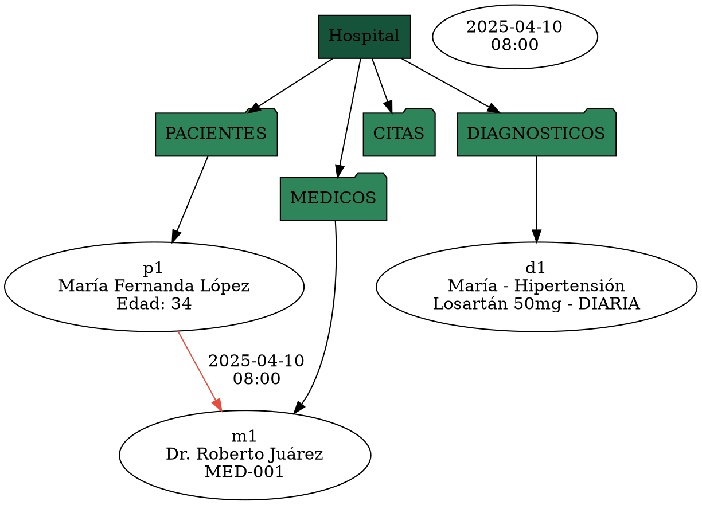

# Manual Técnico - MedLang

## 1. Descripción General

**MedLang** es un compilador especializado para la gestión y análisis de datos hospitalarios. Implementa un lenguaje de dominio específico (DSL) que permite definir estructuras de pacientes, médicos, citas y diagnósticos de forma declarativa, con validación léxica, sintáctica y semántica automatizada.

**Tecnología utilizada:**
- Lenguaje: C++17 (ISO/IEC 14882:2017)
- Compilador: MinGW G++ 11.2.0
- Build system: CMake 3.21+
- GUI: Qt 6.5.3
- Visualización: Graphviz (formato DOT)

**Componentes principales:**
1. **Lexer** (Análisis Léxico) - Tokenización y validación
2. **Parser** (Análisis Sintáctico) - Parsing descendente recursivo
3. **SemanticAnalyzer** (Análisis Semántico) - Validación de reglas de negocio
4. **Generator** (Generación de Reportes) - Exportación a HTML y DOT

---

## 2. Arquitectura del Sistema

### 2.1 Vista General

```
┌─────────────────────────────────────────────┐
│     Interfaz (CLI + Qt GUI)                 │
│  ┌─────────────────────────────────────────┤
│  │ Carga archivo .med                      │
│  └────────────────┬────────────────────────┤
│                   ↓                           │
│  ┌─────────────────────────────────────────┤
│  │ MedLangService (Orquestador)            │
│  │  - Lexer: tokenización                  │
│  │  - Parser: parsing                      │
│  │  - SemanticAnalyzer: validación         │
│  │  - Generator: reportes                  │
│  └────────────────┬────────────────────────┤
│                   ↓                           │
│  ┌─────────────────────────────────────────┤
│  │ Salidas                                 │
│  │  - reporte_lexico.html                  │
│  │  - historial_pacientes.html             │
│  │  - carga_medicos_especialidad.html      │
│  │  - agenda_citas_conflictos.html         │
│  │  - estadistico_general_hospital.html    │
│  │  - hospital.dot (Graphviz)              │
│  │  - indice_reportes.html                 │
│  └─────────────────────────────────────────┤
└─────────────────────────────────────────────┘
```

### 2.2 Estructura de Capas

#### Capa de Presentación (GUI)
- **MainWindow.cpp/h**: Interfaz Qt con preview, análisis y exportación
- **main.cpp (GUI)**: Punto de entrada de aplicación gráfica

#### Capa de Aplicación
- **MedLangService.cpp**: Orquestación del flujo de análisis
- **main.cpp (CLI)**: Interfaz de línea de comandos

#### Capa de Análisis
- **Lexer.cpp**: Tokenización y validación de símbolos
- **Parser.cpp**: Parsing sintáctico
- **SemanticAnalyzer.cpp**: Análisis semántico

#### Capa de Modelos
- **HospitalModel.h**: Estructuras de datos (Paciente, Médico, Cita, Diagnóstico)

#### Capa de Generación
- **LexicalReport.cpp**: Exportación de tabla de tokens
- **Patients.cpp**: Reporte de historial de pacientes
- **Doctors.cpp**: Reporte de carga de médicos
- **Appointments.cpp**: Reporte de agenda de citas
- **Hospital.cpp**: Reporte estadístico general
- **Graphviz.cpp**: Generación de diagrama DOT
- **Html.cpp**: Estilos CSS y utilidades HTML

---

## 3. Análisis Léxico (Lexer)

### 3.1 Autómata Finito Determinista (AFD)

El Lexer implementa un AFD que reconoce las siguientes categorías de tokens:

#### Estados del AFD

```
┌─────────────────────────────────────────────────────────────────┐
│                    ESTADO INICIAL (Start)                       │
└────────────────────────┬────────────────────────────────────────┘
                         │
        ┌────────────────┼────────────────┬─────────────┬───────┐
        │                │                │             │       │
        ↓                ↓                ↓             ↓       ↓
    [a-z,A-Z]       [0-9]            ["]         [:/,[]   Otros
        │                │                │             │       │
        ↓                ↓                ↓             ↓       ↓
    IDENTIFIER      NUMBER         STRING      OPERATORS  ERROR
        │                │                │             │       │
        └────Validación de Palabras Clave────────────  ─┘       │
                       │                                        │
                       ↓                                        │
            ┌──────────────────────────┐                        │
            │  Catálogos de Validación │                        │
            │  - Keywords              │                        │
            │  - Specialties           │                        │
            │  - Dose Frequencies      │                        │
            │  - Blood Types           │                        │
            │  - Code patterns         │                        │
            └──────────────────────────┘                        │
                       │                                        │
             ┌─────────┴────────┐                               │
             ↓                  ↓                               │
        VÁLIDO               INVÁLIDO ←─────────────────────────┘
```

### 3.2 Categorías de Tokens

| Categoría | Ejemplos | Patrón |
|-----------|----------|--------|
| **Keywords** | `HOSPITAL`, `PACIENTES`, `edad`, `tipo_sangre` | Palabras reservadas del DSL |
| **Identifiers** | `"María Fernanda López"`, `"Dr. Roberto"` | Cadenas entre comillas |
| **Numbers** | `34`, `101`, `50` | Secuencias de dígitos |
| **Dates** | `2025-04-10` | Formato YYYY-MM-DD |
| **Hours** | `08:00`, `14:30` | Formato HH:MM |
| **Blood Types** | `A+`, `O-`, `B+`, `AB-` | Letras + signo |
| **Code IDs** | `MED-001`, `CARDIOLOGIA` | Formato específico |
| **Dose Frequencies** | `DIARIA`, `CADA_12_HORAS`, `SEMANAL` | Enumeraciones |
| **Specialties** | `CARDIOLOGIA`, `NEUROLOGIA`, `PEDIATRIA` | Enumeraciones |
| **Operators** | `[`, `]`, `:`, `,` | Símbolos sintácticos |

### 3.3 Validaciones del Lexer

#### Validación de Identificadores (nombres de personas)
```cpp
// Patrones y reglas:
// - Mínimo 3 caracteres
// - Contiene al menos un espacio
// - Puede contener puntos (ej: Dr., Dra.)
// - Acepta acentos y caracteres latinos
```

#### Validación de Códigos de Médicos
```cpp
// Patrón: MED-XXX (donde XXX son 3 dígitos)
// Validada con expresión regular
isValidCodeId("MED-001") → true
isValidCodeId("MED-1")   → false
isValidCodeId("DOC-001") → false
```

#### Validación de Fechas
```cpp
// Formato: YYYY-MM-DD
// Restricciones:
// - Año: 1900-2099
// - Mes: 01-12
// - Día: 01-31 (validación simple de rango)
isValidDate("2025-04-10") → true
isValidDate("25-4-10")    → false
```

#### Validación de Horas
```cpp
// Formato: HH:MM
// Restricciones:
// - Hora: 00-23
// - Minuto: 00-59
isValidHour("08:00") → true
isValidHour("25:00") → false
```

#### Detección de Typos
```cpp
// Usa distancia de Levenshtein (one-edit distance)
// Sugerencias para palabras mal escritas
"HOSIPTAL" → Sugerencia: "HOSPITAL"
"PACIENT"  → Sugerencia: "PACIENTE"
```

### 3.4 Manejo de Errores Léxicos

Cada error léxico registra:
- **Número**: Contador secuencial
- **Lexema inválido**: Token problemático
- **Tipo de error**: Categoría (ej: "Identificador inválido")
- **Descripción**: Mensaje específico del error
- **Línea/Columna**: Ubicación exacta

**Ejemplos de errores léxicos:**
```
Error 1: Lexeme "HOSIPTAL" - Typo sugerencia: HOSPITAL
Error 2: Lexeme "MED--001" - Invalid code format
Error 3: Lexeme "25-4-10" - Invalid date format
```

---

## 4. Análisis Sintáctico (Parser)

### 4.1 Gramática del Lenguaje

```ebnf
program          ::= "HOSPITAL" "{" blocks "}" ";"
blocks           ::= (pacientesBlock | medicosBlock | citasBlock | diagnosticosBlock)*
pacientesBlock   ::= "PACIENTES" "{" pacienteDecl* "}" ";"
pacienteDecl     ::= "paciente:" STRING "[" pacienteAttrs "]" ","?
pacienteAttrs    ::= ("edad:" NUMBER | "tipo_sangre:" STRING | "habitacion:" NUMBER)*
medicosBlock     ::= "MEDICOS" "{" medicoDecl* "}" ";"
medicoDecl       ::= "medico:" STRING "[" medicoAttrs "]" ","?
medicoAttrs      ::= ("especialidad:" SPECIALTY | "codigo:" CODEID)*
citasBlock       ::= "CITAS" "{" citaDecl* "}" ";"
citaDecl         ::= "cita:" STRING "con" STRING "[" citaAttrs "]" ","?
citaAttrs        ::= ("fecha:" DATE | "hora:" HOUR)*
diagnosticosBlock ::= "DIAGNOSTICOS" "{" diagnosticoDecl* "}" ";"
diagnosticoDecl  ::= "diagnostico:" STRING "[" diagnosticoAttrs "]" ","?
diagnosticoAttrs ::= ("condicion:" STRING | "medicamento:" STRING | "dosis:" FREQUENCY)*
```

### 4.2 Estrategia de Parsing

**Tipo**: Parsing descendente recursivo predictivo (LL(1))

**Nota clave sobre lectura de entrada**:
- El **Parser no lee caracteres del archivo**.
- El archivo se recorre primero en el **Lexer**, que consume caracter por caracter.
- En esa fase se ignoran espacios, tabulaciones, saltos de linea y comentarios.
- El Parser recibe un `vector<Token>` ya limpio y estructurado.

**Flujo real (Lexer -> Parser)**:
1. `Lexer::nextToken()` produce tokens secuenciales.
2. `MedLangService` almacena esos tokens en un arreglo hasta `EndOfFile`.
3. `Parser` avanza sobre ese arreglo con `peek`, `match`, `expect` y `advance`.
4. Si el token esperado no coincide, se registra error sintactico y se intenta recuperar.

**Ejemplo simplificado de consumo de tokens**:
```cpp
// Entrada ya tokenizada:
// Cita, Colon, CADENA, Con, CADENA, LBracket, Fecha, Colon, FECHA_LITERAL,
// Comma, Hora, Colon, HORA_LITERAL, RBracket, Comma

ok = consume(TokenType::Cita, "cita", declToken) && ok;
ok = expect(TokenType::Colon, ":") && ok;
ok = consume(TokenType::CADENA, "CADENA (paciente)", pacienteToken) && ok;
ok = expect(TokenType::Con, "con") && ok;
ok = consume(TokenType::CADENA, "CADENA (medico)", medicoToken) && ok;
```

**Comparacion con JavaScript (conceptual)**:
- Si, el enfoque es similar al pipeline de compiladores/engines: **tokenizar primero, parsear despues**.
- La diferencia importante es que este parser es LL(1) manual y predictivo, orientado a la gramatica de MedLang.

### 4.3 Recuperación de Errores

**Estrategia "Panic Mode"**:
- Descarta tokens hasta encontrar un sincronizador (ej: `;`, `}`)
- Registra errores sintácticos con línea/columna
- Continúa parsing del resto del programa
- Permite identificar múltiples errores en una pasada

```cpp
void Parser::synchronize() {
  while (!isAtEnd()) {
    if (m_current > 0 && previous().type == TokenType::Semicolon) {
      return;
    }

    if (peek().type == TokenType::Paciente ||
      peek().type == TokenType::Pacientes ||
      peek().type == TokenType::Medicos ||
      peek().type == TokenType::Citas ||
      peek().type == TokenType::Diagnosticos ||
      peek().type == TokenType::RBrace) {
      return;
    }

    advance();
  }
}
```

### 4.4 Errores Sintácticos

Cada error registra:
- **Número**: Contador secuencial
- **Mensaje**: Descripción del problema
- **Esperado**: Qué se esperaba
- **Encontrado**: Qué se encontró
- **Línea/Columna**: Ubicación exacta

---

## 5. Análisis Semántico

### 5.1 Reglas de Validación

#### Regla 1: Unicidad de Códigos de Médicos
```
Restricción: No pueden existir dos médicos con el mismo "codigo"
Violación detecta: ERROR SEMÁNTICO
Mensaje: "Duplicate doctor code: MED-001 already exists"
```

#### Regla 2: Existencia de Pacientes en Citas
```
Restricción: El paciente referenciado en CITAS debe existir en PACIENTES
Violación detecta: ERROR SEMÁNTICO
Mensaje: "Patient 'Juan Pérez' in appointment not found in patients block"
```

#### Regla 3: Existencia de Médicos en Citas
```
Restricción: El médico referenciado en CITAS debe existir en MEDICOS
Violación detecta: ERROR SEMÁNTICO
Mensaje: "Doctor 'Dr. García' in appointment not found in doctors block"
```

#### Regla 4: Existencia de Pacientes en Diagnósticos
```
Restricción: El paciente en DIAGNOSTICOS debe existir en PACIENTES
Violación detecta: ERROR SEMÁNTICO
Mensaje: "Patient 'María López' in diagnosis not found in patients block"
```

#### Regla 5: Detección de Conflictos de Citas
```
Restricción: El mismo médico no puede tener dos citas en la misma fecha y hora
Clave de conflicto: "medico|fecha|hora"
Violación detecta: ERROR SEMÁNTICO (ConflictoHorario)
Mensaje: "Schedule conflict: Dr. Juárez has appointment conflict on 2025-04-10 at 08:00"
```

#### Regla 6: Clasificación de Diagnósticos Críticos
```
Criterios:
- Condición contiene palabras clave: "crítico", "grave", "severo", "urgente"
- Dosis frecuencia ≤ 4 horas: CADA_4_HORAS, CADA_2_HORAS, CADA_HORA
- ACción: Marca diagnóstico como crítico en reportes
Estado en reporte: Color ROJO (#c0392b)
```

### 5.2 Estructura del Analizador Semántico

```cpp
class SemanticAnalyzer {
public:
    void analyze(const Hospital& hospital);
    const SemanticValidation& getValidation() const;
    
private:
    void validateBasicRules(const Hospital& hospital);
    void validateReferencesIntegrity(const Hospital& hospital);
    void detectScheduleConflicts(const Hospital& hospital);
    void classifyDiagnosis(Hospital& hospital);
    
    // Catálogos para validación rápida
    std::unordered_set<std::string> patientNames;
    std::unordered_set<std::string> doctorNames;
    std::unordered_set<std::string> doctorCodes;
    std::map<std::string, int> appointmentsByDoctorDate;
};
```

### 5.3 Estructura de Errores Semánticos

```cpp
struct SemanticError {
    int number;                    // Contador
    std::string type;              // "ReferenciaInvalida", "ConflictoHorario", etc.
    std::string message;           // Descripción detallada
    std::string relatedEntity;     // Entidad problemática
    int line;
    int column;
};
```

---

## 6. Generación de Reportes

### 6.1 Pipeline de Exportación

```
HospitalModel
    ↓
┌─────────────────────────────────────────┐
│ Generator::generateReports()            │
├─────────────────────────────────────────┤
│ Lexer Report (reporte_lexico.html)      │
├─────────────────────────────────────────┤
│ Patient History (historial_pacientes)   │
│ - Table: Paciente | Edad | Sangre | ... │
├─────────────────────────────────────────┤
│ Doctor Workload (carga_medicos)         │
│ - Table: Médico | Código | Especialidad │
├─────────────────────────────────────────┤
│ Appointments (agenda_citas)             │
│ - Table: Fecha | Hora | Paciente | ...  │
├─────────────────────────────────────────┤
│ Hospital Summary (estadistico_general)  │
│ - Metrics: Total Pacientes, Prom. Edad  │
├─────────────────────────────────────────┤
│ Graphviz DOT (hospital.dot)             │
│ - Digraph: Nodes y edges de entidades   │
├─────────────────────────────────────────┤
│ Index (indice_reportes.html)            │
│ - Links a todos los reportes            │
└─────────────────────────────────────────┘
    ↓
Output Directorio
```

### 6.2 Schemas de Reportes

#### Reporte Léxico (LexicalReport)
```html
<table>
  <tr>
    <th>Número</th><th>Lexema</th><th>Tipo</th>
    <th>Línea</th><th>Columna</th><th>Descripción</th>
  </tr>
  <!-- Una fila por token válido + errores -->
</table>
```

#### Historial de Pacientes (Patients)
```html
<table>
  <tr>
    <th>Paciente</th><th>Edad</th><th>Tipo Sangre</th>
    <th>Diagnóstico Activo</th><th>Medicamento/Dosis</th><th>Estado</th>
  </tr>
  <!-- Fila por paciente con color según criticidad -->
</table>
```

#### Carga de Médicos (Doctors)
```html
<table>
  <tr>
    <th>Médico</th><th>Código</th><th>Especialidad</th>
    <th>Citas Programadas</th><th>Pacientes Únicos</th><th>Nivel de Carga</th>
  </tr>
  <!-- Fila por médico; color según: BAJA(azul), NORMAL(verde), ALTA(naranja), SATURADA(rojo) -->
</table>
```

#### Agenda de Citas (Appointments)
```html
<table>
  <tr>
    <th>Fecha</th><th>Hora</th><th>Paciente</th>
    <th>Médico</th><th>Especialidad</th><th>Estado</th>
  </tr>
  <!-- Fila por cita; colores: Conflicto(rojo), Pendiente(naranja), Confirmada(verde) -->
</table>
```

#### Estadístico General (Hospital)
```html
<div class="metrics">
  <div class="card">
    <label>Total de Pacientes</label>
    <value>12</value>
  </div>
  <!-- Más cards con métricas agregadas -->
</div>
```

### 6.3 Esquema Graphviz (DOT)



### 6.4 Paleta de Colores CSS

| Estado | Color | Hex | Uso |
|--------|-------|-----|-----|
| OK/NORMAL | Verde | #2f855a | Status normal, BAJA carga |
| ADVERTENCIA | Naranja | #e67e22 | Pendiente, ALTA carga |
| PELIGRO | Rojo | #c0392b | Crítico, SATURADA, Conflicto |
| INFO | Azul | #1f618d | Información adicional |

---

## 7. Decisiones de Diseño

### 7.1 ¿Por qué Parsing Descendente Recursivo?

**Ventajas:**
- Fácil de implementar y depurar
- Recuperación natural de errores
- Adecuado para gramáticas LL(1) relativamente simples
- Error messages más específicas


### 7.2 ¿Por qué Validación en Tres Fases?

**Fase 1 (Léxica):** Identificar caracteres/tokens problemáticos rápidamente
**Fase 2 (Sintáctica):** Validar estructura sin suspender análisis
**Fase 3 (Semántica):** Validar lógica de negocio y referencias

**Beneficio:** Permite reportar múltiples tipos de errores juntos para mejor UX


```
```

### 7.3 ¿Por qué Graphviz DOT?

**Ventajas:**
- Formato abierto y portable
- Visualizable con herramientas estándar (Graphviz Online, PlantUML, etc.)
- Estructura declarativa que refleja la jerarquía del hospital
- Facilita debugging de relaciones complejas

**Alternativas consideradas:**
- Diagrama PNG embebido: Pérdida de estructura
- SVG manual: Mantenimiento complejo
- JSON Graph: Requiere viewer personalizado

---

## 8. Estructura de Directorios

```
Proyect 1/
├── src/
│   ├── app/
│   │   ├── main.cpp                 (CLI)
│   │   └── MedLangService.cpp       (Orquestación)
│   ├── core/
│   │   ├── lexer/
│   │   │   ├── Lexer.h/cpp
│   │   │   ├── Token.h
│   │   │   ├── LexerCatalog.cpp
│   │   │   └── LexerValidators.cpp
│   │   ├── parser/
│   │   │   ├── Parser.h/cpp
│   │   │   └── HospitalModel.h
│   │   ├── semantic/
│   │   │   └── SemanticAnalyzer.h/cpp
│   │   └── report/
│   │       ├── Generator.h/cpp
│   │       ├── Html.h/cpp
│   │       ├── LexicalReport.h/cpp
│   │       ├── Patients.h/cpp
│   │       ├── Doctors.h/cpp
│   │       ├── Appointments.h/cpp
│   │       ├── Hospital.h/cpp
│   │       └── Graphviz.h/cpp
│   └── gui/
│       ├── main.cpp                 (GUI)
│       ├── MainWindow.h/cpp
│       └── resources/
│           └── medlang.qrc
├── build/                           (Artifacts)
├── test/
│   ├── hospital_valido_01.med
│   ├── hospital_valido_02.med
│   ├── hospital_errores_01.med
│   └── hospital_errores_02.med
├── output/                          (Generated reports)
├── docs/
│   ├── manual_tecnico.md           (Este archivo)
│   ├── manual_usuario.md
│   └── README.md
├── CMakeLists.txt
└── Checklist.md
```

---

## 9. Flujo de Ejemplo: Análisis de Hospital

### Entrada: `hospital_valido_01.med`
```
HOSPITAL {
    PACIENTES {
        paciente: "María Fernanda López" [edad: 34, tipo_sangre: "A+", habitacion: 101],
        ...
    };
    MEDICOS { ... };
    CITAS { ... };
    DIAGNOSTICOS { ... };
};
```

### Fase 1: Lexer
```
Token 1: KEYWORD_HOSPITAL "HOSPITAL" L1:C1
Token 2: LEFT_BRACE "{" L1:C10
Token 3: KEYWORD_PACIENTES "PACIENTES" L2:C5
...
(Genera: reporte_lexico.html con ~50 tokens)
```

### Fase 2: Parser
```
parse program()
  → parseBlock(PACIENTES)
    → parsePacienteDecl()
      → "María Fernanda López" [edad:34, tipo_sangre:"A+", habitacion:101]
      → Genera Patient{name, edad, tipo_sangre, habitacion}
    → parsePacienteDecl()
      → ...
  → parseBlock(MEDICOS)
    → ...
  → parseBlock(CITAS)
    → ...
  → parseBlock(DIAGNOSTICOS)
    → ...
```

### Fase 3: SemanticAnalyzer
```
1. Validar unicidad de códigos médicos ✓
2. Verificar existencia de pacientes en CITAS ✓
3. Verificar existencia de médicos en CITAS ✓
4. Detectar conflictos horarios ✓
5. Clasificar diagnósticos críticos ✓
```

### Fase 4: Generator
```
1. LexicalReport::generate() → reporte_lexico.html
2. Patients::generate() → historial_pacientes.html
3. Doctors::generate() → carga_medicos_especialidad.html
4. Appointments::generate() → agenda_citas_conflictos.html
5. Hospital::generate() → estadistico_general_hospital.html
6. Graphviz::generate() → hospital.dot
7. Generator::writeIndex() → indice_reportes.html (links a todos)
```

### Salida: Directorio `output/`
```
output/
├── reporte_lexico.html
├── historial_pacientes.html
├── carga_medicos_especialidad.html
├── agenda_citas_conflictos.html
├── estadistico_general_hospital.html
├── hospital.dot
└── indice_reportes.html
```

---

## 10. Extensibilidad y Mejoras Futuras

### Mejoras Potenciales

1. **Validación de Dominio**
   - Rango de edades válidas (ej: 0-150)
   - Códigos de especialidad contra catálogo oficial
   - Número de habitación dentro del rango del hospital

2. **Análisis Avanzado**
   - Detección de patrones de comorbilidad
   - Análisis de carga de especialidades
   - Predicción de disponibilidad médica

3. **Formatos Adicionales**
   - JSON export para APIs
   - CSV para análisis estadístico
   - XLS para reportes ejecutivos

4. **Optimizaciones**
   - Caching de análisis sintáctico
   - Validación incremental
   - Paralelización de generación de reportes

---

## 11. Bibliografía y Referencias

- **Lenguaje C++17**: ISO/IEC 14882:2017
- **Compilers: Principles, Techniques, and Tools** (Dragon Book) - Aho, Lam, Sethi, Ullman
- **Qt 6 Dokumentation**: https://doc.qt.io/qt-6/
- **GraphViz**: https://graphviz.org/
- **CMake**: https://cmake.org/documentation/

---
